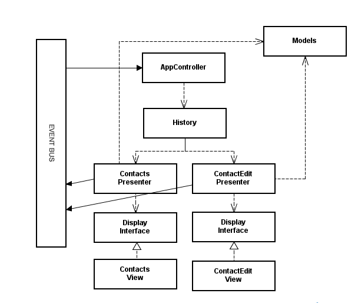

## GWT Tutorials: Google Web Toolkit!

Learn how to program HTML5 web apps in Java with GWT. 
The Google Web Toolkit 2.5.1 compiler generates highly optimized JavaScript code. This GWT tutorial series will walk you through what it is, how to install it, and how to start coding with it, all the way through developing more complex web applications using the Java language, and ending with awesome HTML5 code.
We'll also cover design patterns specific to GWT, including the MVP pattern (model view presenter), as well as UIBinder, GWT RPC, JSON, and other advanced topics
[AuthorsGitRepo](https://github.com/formigone/elt-google-web-toolkit)

## Progress

- [x] 01 - Google Web Toolkit 2014 - GWT Tutorial
- [x] 02 - What is Google Web Toolkit - GWT Tutorial
- [x] 03 - Installing SDK & Eclipse Plugin - GWT Tutorial (Google Web Toolkit)
- [x] 04 - Hello World - GWT Tutorial (Google Web Toolkit)
- [x] 05 - GWT Application Structure - GWT Tutorial (Google Web Toolkit)
- [x] 06 - Designing with UiBinder - GWT Tutorial (Google Web Toolkit)
- [x] 07 - UiBinder Git Repository - GWT Tutorial (Google Web Toolkit)
- [x] 08 - Widgets & Event Handlers - GWT Tutorial (Google Web Toolkit)
- [x] 09 - Widgets & Application Themes - GWT Tutorial (Google Web Toolkit)
- [o] 10 - MVP - Model View Presenter - GWT Tutorial (Google Web Toolkit)
- [ ] 11 - 
- [ ] 12 - 
- [ ] 13 - 
- [ ] 14 -  
- [ ] 15 - 

 NOTES
-------------

Part 05 notes
-------------
- GWT application is organized into modules
	- Module is encapsulation of app or part of it
	
- Module is having manifest file or module descriptor
	- Its xml file that descripes the module, in our case HellowWorld.gwt.xml
	HERE SOME BASIC OF TAGS IN MANIFEST FILES
	- <inherits name ="import anyhing"/> Importing stuff
	- <module renmae-to="new name"> Renames fully qualified path to shortcut to module
	- <source path="client"> spesifies package in GWT project to translate Java to Js
		- In this case "client" package is going to be translated to Js when compiled
	- <entry-point class="com.fully.qualifed.name.of.file"/> First class which will be loaded when package is loaded to browser
		- Needs to be in source path and Java class needs implement EntryPoint
- Gwt application need at least one HTML file where thing will be loaded to browser
	-Check your HTML file is referencing Js for bootstrap functionality
		- Hello.nocache.js <- bootsrap, detects environment settings(ie. browser)
		- 
		- HTML needs to point to module
		
Part 10 notes
-------------
MVP = Model View Presenter

use of MVP in old way [Building MVP apps: MVP Part I](http://www.gwtproject.org/articles/mvp-architecture.html)
use of MVP in new way(UiBinder way) [Building MVP apps: MVP Part I](http://www.gwtproject.org/articles/mvp-architecture-2.html)

