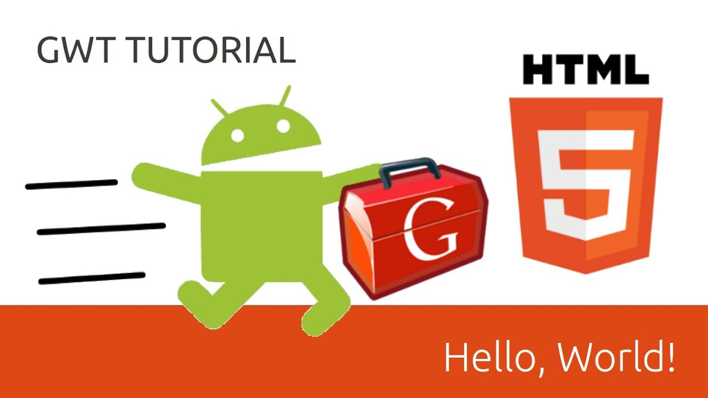

## GWT Tutorials: Google Web Toolkit!

Learn how to program HTML5 web apps in Java with GWT. 
The Google Web Toolkit 2.5.1 compiler generates highly optimized JavaScript code. This GWT tutorial series will walk you through what it is, how to install it, and how to start coding with it, all the way through developing more complex web applications using the Java language, and ending with awesome HTML5 code.
We'll also cover design patterns specific to GWT, including the MVP pattern (model view presenter), as well as UIBinder, GWT RPC, JSON, and other advanced topics

## Progress

- [x] 01 - Google Web Toolkit 2014 - GWT Tutorial
- [x] 02 - What is Google Web Toolkit - GWT Tutorial
- [x] 03 - Installing SDK & Eclipse Plugin - GWT Tutorial (Google Web Toolkit)
- [x] 04 - Hello World - GWT Tutorial (Google Web Toolkit)
- [ ] 06 - 
- [x] 05 - GWT Application Structure - GWT Tutorial (Google Web Toolkit)
- [ ] 07 - 
- [ ] 08 - 
- [ ] 09 - 
- [ ] 10 -
- [ ] 11 - 
- [ ] 12 - 
- [ ] 13 - 
- [ ] 14 - 
- [ ] 15 - 
