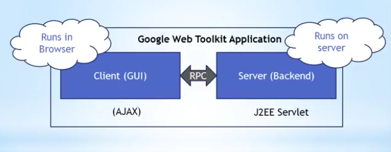
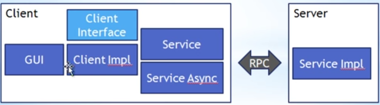

GWT tutorial series.

## Progress

- [x] GWT Tutorial 0.1 - Installing, and debugging with, Eclipse
- [x] GWT Tutorial 0.2 - Installing the GWT Plugin in Eclipse
- [x] GWT Tutorial - 0.3 - Using GWT Super Dev Mode to Run and Debug GWT Projects
- [o] GWT Tutorial 1.0 - Basics of GWT and GUI Building 38:00
- [ ] GWT Tutorial 1.1 - Proper Architecture for GWT GUI Building
- [x] GWT Tutorial 2.0 - Remote Procedure Calls (RPC) with GWT
- [x] GWT Tutorial 2.1 - Remote Procedure (RPC) Calls with Complex Datatypes
- [ ] GWT Tutorial 2.2 - Remote Procedure Calls (RPC) with Complex Datatypes - Part 2
- [ ] GWT Tutorial 2.3 - Easy Error Handling with Remote Procedure Calls (RPC)

 x = done
 o = in progress

Notes
===========
GWT Tutorial 1.0 - Basics of GWT and GUI Building
--------------------------------------------------

- GWT is AJAX Toolkit

- Advantages of AJAX based Web Applications:
	- Offers rich functionality whitout needing plugins
		- Essentially are applications based on HTML and Javascript
	- Runs on all platforms
	- Runs on all browsers

- Disdvantages of AJAX based Web Application:
	- Every web browsers handles AJAX differently

Why GWT?

- GWT deals with every browser AJAX differently 
- Java code -> spesific AJAX code for every browser
	-  Write one set of code, run on all browsers!
		- Some minor problems still occur on some browsers

- GWT come with a lot of pre-build components
	- Styling is done in CSS
	- Support for inclusion of third party components

- GWT takes a strong OO approach to Software Architecture
	- Same as Java

Breakdown of GWT App

- edu.example.
	nameOfProject.gwt.xml <-- GWT spesific configuration file. ie 3rd party

- war folder <-- All the web content must be here

Widgets

- Panels way to structure your site
	 

GWT Tutorial 2.0 - Remote Procedure Calls (RPC) with GWT
https://www.youtube.com/watch?v=Hd5vnHNylB8
---------------------------------------------

- Communicate between Client and Server using Remote Procedure Call (RPC)
- RPC -> Making RPC Call is like invoking a method in a class located on a server.

The trouble with RPC
--------------------

- AJAX, or Javascript, runs in your web browser.
- Browser is single threaded
	- Meaning, if you make a RPC call, your browser will hang until a response is received.
	- To avoid the browser hanging, a GWT RPC call is made "Asynchronous".
	- When making Asynchronous calls, the browser does not hang while waiting for a response.

- Async methods doesn't never return value(void value) -> Values are coming back with callbacks!

-----------------------------------------------

GWT Tutorial 2.1 - Remote Procedure (RPC) Calls with Complex Datatypes
https://www.youtube.com/watch?v=dBZyWq13AQg
--------------------------------------------

- Object Oriented practices data is usually handled inside the system in the form of Objects instead primitive types.

- Not every object can by default be sent from the server to the client
	- A object needs to be converted to a binary format so it can be sent.
	- This is done in GWT by implementing the "Serializable" interface in every object that is sent 	from the server to the client and vice versa.
	- This also means that objects can only contain attributes which are primitive types, or are 	objects that in turn can be Serialized 

GWT tutorial series.

## Progress

- [x] GWT Tutorial 0.1 - Installing, and debugging with, Eclipse
- [x] GWT Tutorial 0.2 - Installing the GWT Plugin in Eclipse
- [x] GWT Tutorial - 0.3 - Using GWT Super Dev Mode to Run and Debug GWT Projects
- [o] GWT Tutorial 1.0 - Basics of GWT and GUI Building 14:00
- [ ] GWT Tutorial 1.1 - Proper Architecture for GWT GUI Building
- [x] GWT Tutorial 2.0 - Remote Procedure Calls (RPC) with GWT
- [x] GWT Tutorial 2.1 - Remote Procedure (RPC) Calls with Complex Datatypes
- [ ] GWT Tutorial 2.2 - Remote Procedure Calls (RPC) with Complex Datatypes - Part 2
- [ ] GWT Tutorial 2.3 - Easy Error Handling with Remote Procedure Calls (RPC)

 x = done
 o = in progress

Notes
===========
GWT Tutorial 1.0 - Basics of GWT and GUI Building
--------------------------------------------------

- GWT is AJAX Toolkit

- Advantages of AJAX based Web Applications:
	- Offers rich functionality whitout needing plugins
		- Essentially are applications based on HTML and Javascript
	- Runs on all platforms
	- Runs on all browsers

- Disdvantages of AJAX based Web Application:
	- Every web browsers handles AJAX differently

Why GWT?

- GWT deals with every browser AJAX differently 
- Java code -> spesific AJAX code for every browser
	-  Write one set of code, run on all browsers!
		- Some minor problems still occur on some browsers

- GWT come with a lot of pre-build components
	- Styling is done in CSS
	- Support for inclusion of third party components

- GWT takes a strong OO approach to Software Architecture
	- Same as Java

Breakdown of GWT App

GWT Tutorial 2.0 - Remote Procedure Calls (RPC) with GWT
https://www.youtube.com/watch?v=Hd5vnHNylB8
---------------------------------------------

- Communicate between Client and Server using Remote Procedure Call (RPC)
- RPC -> Making RPC Call is like invoking a method in a class located on a server.

The trouble with RPC
--------------------

- AJAX, or Javascript, runs in your web browser.
- Browser is single threaded
	- Meaning, if you make a RPC call, your browser will hang until a response is received.
	- To avoid the browser hanging, a GWT RPC call is made "Asynchronous".
	- When making Asynchronous calls, the browser does not hang while waiting for a response.

- Async methods doesn't never return value(void value) -> Values are coming back with callbacks!

-----------------------------------------------

GWT Tutorial 2.1 - Remote Procedure (RPC) Calls with Complex Datatypes
https://www.youtube.com/watch?v=dBZyWq13AQg
--------------------------------------------

- Object Oriented practices data is usually handled inside the system in the form of Objects instead primitive types.

- Not every object can by default be sent from the server to the client
	- A object needs to be converted to a binary format so it can be sent.
	- This is done in GWT by implementing the "Serializable" interface in every object that is sent 	from the server to the client and vice versa.
	- This also means that objects can only contain attributes which are primitive types, or are 	objects that in turn can be Serialized 

